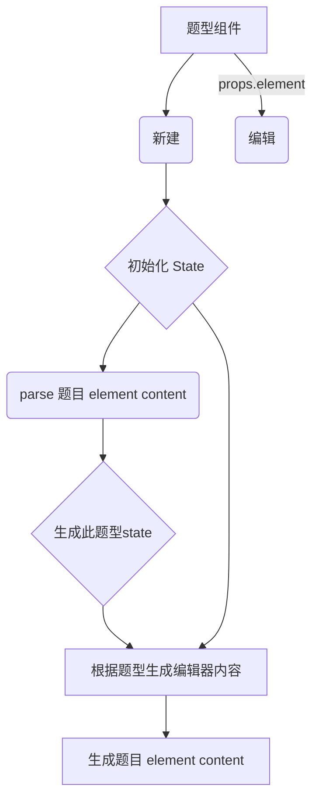

```mermaid
graph TD

A[题型组件] --> B(新建)
B --> C{初始化 State}
A -->|props.element| D(编辑)
C --> E(parse 题目 element content)
E --> F{生成此题型state}
F --> G[根据题型生成编辑器内容]
C --> G
G --> H[生成题目 element content]
```